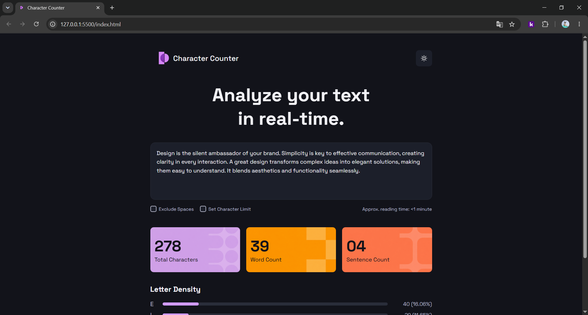
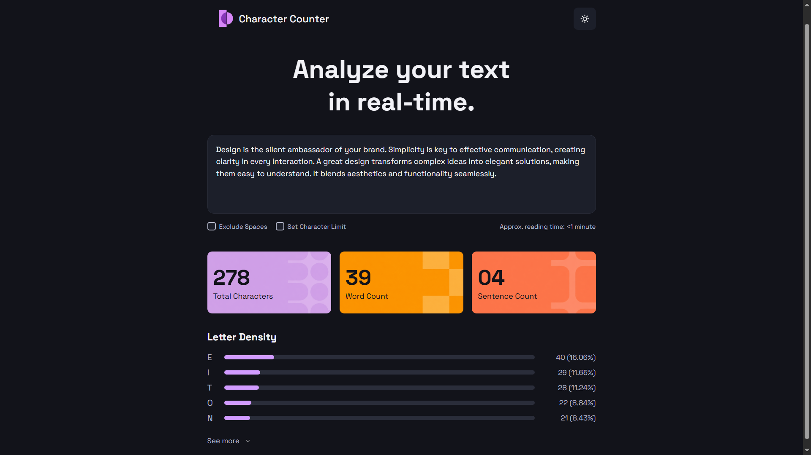
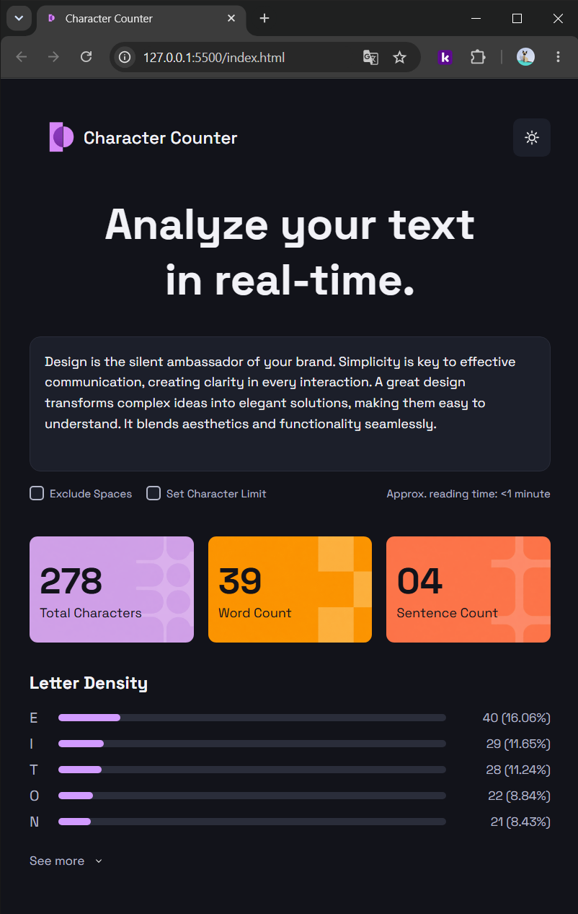

# Character Counter

## Objetivos del proyecto
El objetivo de este proyecto es replicar visualmente el diseño de una aplicación llamada Character Counter, utilizando únicamente HTML y CSS. Los valores son estáticos y el foco está puesto en el maquetado semántico, el uso de Flexbox, la estilización avanzada con CSS y las buenas prácticas de organización del código.
En esta primera etapa no se hará uso de Javascript, será agregado al proyecto posteriormente.

### En el proyecto se repetará:
- Distribución visual.
- Espaciados.
- Colores.
- Tipografía.
- Bordes redondeados.
- Tarjetas de estadísticas.
- Jerarquía visual del contenido.

### Funcionalidades futuras con Javascript:
- Conteo real de caracteres.
- Conteo de palabras.
- Conteo de oraciones.
- Cálculo de tiempo de lectura.
- Generación automática de densidad de letras.

## Tecnologías y herramientas utilizadas
- HTML
- CSS
- Google Fonts
- Git y GitHub
- Visual Studio Code
- Copilot (para generación de imágenes de assets)
- Remove.bg (para obtener el png de las imágenes generadas)
- [Favicon](https://convertio.co/es/png-ico/)

## Organización del HTML

### Head
En el **Head** fue modificado el **título** de la pestaña a "Character Counter", además se agregó un link al **favicon** guardado en assets/images para modificar el ícono que aparece a su lado. También se linkeó el **CSS** correspondiente para hacer uso de la hoja de estilos.

### Body
En el **Body** lo primero que agregué fue un **div con class "container"** el cual contiene todo lo renderizado. Fue pensado con el objetivo de poder centrar el contenedor en la página. El body cuenta con un **Header** y un **Main**.

#### Header
Dentro del **Header** decidí crear un **div con class "logo-info"** para poder trabajar posteriormente con flexbox más cómodamente, ya que ambos elementos (el logo y su texto) se encontraban juntos. Por otro lado fuera del div creé un **botón** que incluye la imagen del sol. De esta forma pude estilizar ambos elementos, tanto juntos como separados.

#### Main
El **Main** contiene la mayoría de mi código, cuenta con **3 secciones**, pensadas para una mejor organización, estilización y manejo.

#### -Section class "hero":
Esta sección contiene lo principal de la página web, lo primero que se suele leer después del header. Lo primero que aparece es el **h1** con el título principal y luego un **textarea**. Debajo decidí crear un **div con class "text-area-info"** donde hay un **div con class "checkboxes"** que tiene etiquetas **label** que contienen los **input type checkbox** junto a su texto para que el usuario pueda interactuar de forma más eficiente. Dentro del div "text-area-info" también agregué el párrafo con el texto que aparece en la parte inferior derecha del textarea. Elegí esta organización para una mayor eficiencia a la hora de estilizar.

#### -Section class "stats":
Esta sección incluye las tres "cards" las cuales fueron divididas en **3 divs** cada una con su respectiva clase, todas contienen **2 párrafos**. También las dividí de esta forma para tener un mejor manejo de flexbox a la hora de estilizarlas, manteniendo un contenedor madre y sus tres contenedores individuales.

#### -Section class "letter-density":
Empecé colocando un **h2** el cual lleva el subtítulo de la sección. Luego investigué la mejor forma o la más eficiente de hacer barras de progreso y poder manejarlas en CSS sin complicaciones. Me decanté por hacer un **div por cada letra**, cada uno contiene **la letra correspondiente**, un **div class bar** que a su vez contiene un **div vacío con class fill** y luego un **span con los valores**. A cada div vacío le puse dos clases para poder trabajarlos juntos y a su vez por separado, ya que con CSS debía editar el ancho que es el progreso de la barra de cada div.
Al finalizar esta sección, fuera de todos los divs, coloqué un **botón** el cual contiene el **texto** see more y para la flecha apuntando hacia abajo decidí poner un **png** para luego poder trabajarlo de buena manera en CSS con flexbox.

## Cómo resolví el CSS

En cuanto a la hoja de estilos empecé **reseteando** todos los márgenes, padding y ajustando la box-sizing a border-box. Luego **conecté la fuente** que descargué de Google Fonts ("Space Grotesk") declarándola en @font-face y aplicándola en el body, decidí poner **sans-serif como tipografía secundaria** en caso de error o fallo en algún dispositivo. Proseguí con el **:root** dejando las variables de los colores que iba a utilizar en el proyecto. Una vez finalizado con esto que es lo principal fui directo al **body** y luego al **.container** para poder **ajustar el contenedor** en el centro de la pantalla.

Comencé a estilar el contenedor empezando por la parte superior, el **header**. Trabajé con flexbox ajustando **el logo, la info y el botón**.

Continué con el **.hero** alineando y estilizando el titulo, ajustando el ancho para que coincida con el de la imagen base del proyecto y se mantengan la misma cantidad de párrafos.

En cuanto al **textarea** también manejé su margen general y margen entre letras, padding, ancho, alto, bordes, color y ancho de letra, etc. En este caso al finalizar el proyecto decidí incluir en un :focus el **box-shadow** pedido en la consigna, dándole los bordes violetas al hacer click.

A la hora de estilizar los **checkboxes** les di flex para poder ajustar el texto y el input, agregándoles gap, para separarlos y poder ajustarlos correctamente. También decidí darles un **cursor:pointer** para que al pausar el mouse se cambie el cursor de flecha a manito, para darle mejor interactividad visual. Y para finalizar esta sección les di una propiedad **:checked** para que cambien a violeta al clickear.

En los **stats** que son las cards, al tener tres contenedores que quería tener horizontalmente usé flexbox para poder ajustarlos. Luego dentro de cada una le puse un **background-image** para que contengan un diseño de fondo, elegí los mismos que se mostraban en la presentación del proyecto. Utilicé copilot para tener el png y poder aplicarlo.

En el caso de **letter-density** organicé los elementos con flexbox y empecé a estilizar los divs que estaban pensados para representar una barra de progreso. Modifiqué primero la **bar** y luego con **fill** elegí el color dado en el proyecto (violeta) y lo coloqué ajustándolo a la barra. Para finalizar esta parte ajusté el ancho de esta barra que estaba superpuesta a la gris de "bar" con **la clase secundaria de los fill**, de esta forma pude dar el efecto de progresión con solo un div vacío.

Y para finalizar la parte del botón de **"see more"** la cual utilizando flexbox logré alinear la imagen de la flecha hacia abajo con el texto y estilizarlas. Decidí también poner un **cursor:pointer** y agregar un **hover** para que se vea diferente, con más interactividad visual.

## Dificultades encontradas
- **Imágenes:** Las dudas fueron evacuadas en clase, con copilot pude sacar los png necesarios para el proyecto.
- **Estilado del textarea:** Tuve que investigar la forma de mantenerlo en determinado ancho y altura, también aprendí la propiedad *"resize:none"* que ayudó a dejarlo fijo y mantener un mejor estilado.
- **Barras de progreso:** Había varias formas de realizarlas como *"progress, meter, etc."* finalmente me decanté por hacerlas con *divs vacíos* que después pude estilizar en CSS ajustando colores, anchos, etc.
- **README:** Nunca había realizado uno. Si bien fue fácil de aprender y utilicé lo basico, al presentarse el proyecto si lo tomé como una dificultad, pero ahora finalizando me doy cuenta que pude expresar todo lo realizado de una forma fluida.

En cuanto al HTML no se me presentó ninguna dificultad, salvo la de las barras de progreso. Estuve siguiendo los proyectos de práctica en clase, por lo que se me hizo más ameno a la hora de organizarme. Recordé la estructura (header, main, footer, etc.) y las secciones y divisiones que mejor convenían para la hora de organizar el contenido y estilizarlo.
Al continuar los proyectos de clase también el resto del estilado se me hizo más llevadero y pude ajustar los errores necesarios para que quede lo más parecido posible a la imagen del pdf dado.

## Capturas del resultado final

